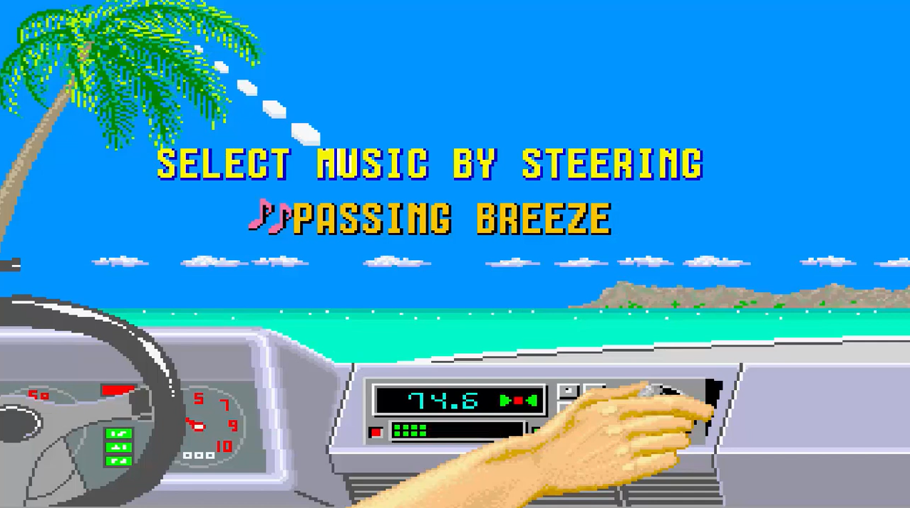

# OutRunPy
OutRun like fan game in Python using PyGame

Clic on the screenshots to see the video

- Arrows Left / Right to turn left / right
- Arrow up accelerate
- Arrow down break
- keypad 1,2,3 change camera height
- Key 1,2,3,4 change music
- ESC to quit the game
- F key to show/hide FPS

To run this game in windows launch build.cmd
The game exe will be located in the /build directory

To run this game in python, first install the prerequisites
- pygame

The game main file is main.py

